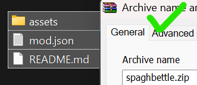
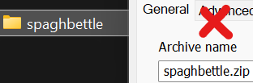

# MODS FOR THE WEB MOD LOADER (WML) ARE *NOT* COMPATIBLE WITH THIS (SMC-DMM) DUE TO DIFFERENCES IN HOW THE GAME FILES ARE STORED

# How to Create a Mod
Creating a mod for Super Mario Construct involves creating a `mod.json` file. Below is a step-by-step guide on how to create a mod using the `mod.json` format.

## Step 1: Create the `mod.json` File
Create a new file named `mod.json` in your mod's directory. This file will contain all the necessary information about your mod.

## Step 2: Define the Mod Metadata

Copy and paste the following JSON structure into your `mod.json` file:

```json
{
	"ID": "your.mod.id",
	"Version": "1.0",
	"Name": "Your Mod Name",
	"GameVersion": "Game Version your mod is built for",
	"AssetsFolder": "assets/yourmod",
	"Description": "A brief description of your mod."
}
```

- **ID**: A unique identifier for your mod. It is recommended to use a reverse domain name notation (e.g., `com.yourname.modname` or `yourname.modname`). While the mod ID *can* be anything and not follow reverse DNS notation, if you take that route, make sure it's unique so that there will be no conflicts.
- **Version**: The version of your mod.
- **Name**: The name of your mod.
- **GameVersion**: The version of the game your mod is compatible with.
- **AssetsFolder**: The folder where your mod's assets are stored. It can be anything ("assets/SMC", "assets/files", "files", just make sure that it is defined in this field)
- **Description**: A brief description of what your mod does.
### Example:
```json
{
	"ID": "theflyingdutchman.spaghbettle",
	"Version": "1.0",
	"Name": "Spaghbettle",
	"GameVersion": "v8.beta29.4",
	"AssetsFolder": "assets/SMC",
	"Description": "Mod replaces all bony beetles with spaghbettles (AKA pastabeetle) in both gamestyles of Super Mario Construct."
}
```

## Step 4: Add Your Mod Assets
Place all the necessary assets for your mod in the folder specified in the `AssetsFolder` field. Double check that the folder structure and file names match what your mod.json defined. You can replace anything so long as it is in the "www" folder of the game, and I mean anything. Sounds, Sprites, Pallates, Tile Maps, anything in there, you can make. You can also add assets, see Touch Controls folder.

## Step 5: Test Your Mod
Place your mod in your Mods folder, load it into the game and test it to make sure everything works as intended.

## Step 6: ZIP your mod
Use any software that can make .zip files ((WinRAR)[https://www.rarlab.com/], (7-Zip)[https://7-zip.org/], etc.) and zip the files in the root directory of your mod folder, NOT the folder your mod is in.
#### Correct Way

#### Incorrect Way


## Share
Share it in the modding forum in the LSS Discord. Make sure to tag it as Desktop and include SMC-DMM in the title of the post.