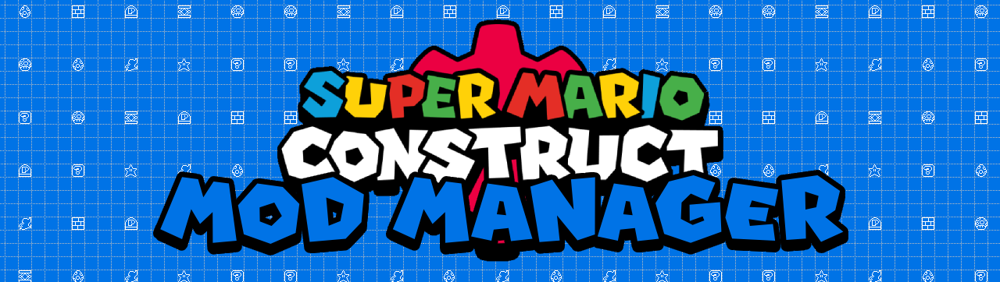

# Super Mario Construct Desktop Mod Manager
Manages replacing game files in Super Mario Construct

### Please report any bugs you find in the [issues tab](https://github.com/WINRARisyou/SMC-Desktop-Mod-Manager/issues), and back up your game directory due to any possible aformentioned bugs.

## Table of Contents
- [How to Use](#how-to-use)
- [Building from Source](#building-from-source)
- [Making Mods](Example%20Mods/README.md)

## How to Use

1. **Set Game Location**:
	- Download it:
		- [Windows](https://github.com/WINRARisyou/SMC-Desktop-Mod-Manager/releases/latest/download/SuperMarioConstructModManager.exe)
		- [Linux](https://github.com/WINRARisyou/SMC-Desktop-Mod-Manager/releases/latest/download/SMC-DMM-Linux)
	- Open the application.
	- Go to `File` > `Set Game Location`.
	- Select the folder where Super Mario Construct is installed (`%appdata%\itch\apps\super-mario-construct` if you installed via itch.io app).

3. **Set Mods Folder Location**: 
	- Go to `File` > `Set Mods Folder Location` (By default, it will be in the same directory as the Mod Manager).
	- Select the folder where your mods are stored.

4. **Enable/Disable Mods**:
	- The main window will display a list of available mods.
	- Double click the checkboxes to enable or disable mods.
	- Use the up and down arrows to adjust the priority of the mods.
    	- Mods higher in the list will override lower mods if they modify the same files
	- Pressing the refresh button will reload the mods list, adding any mods that were placed in the mods folder. This will reset the priorities of mods and will disable any mods that have been enabled unless `Save & Play` is pressed.

5. **Save and Play**:
	- Click the `Save & Play` button to apply the selected mods and start the game.
		- You can download mods from the [LSS Discord](https://discord.gg/m8U8FQw) or directly from DMM by clicking `Tools` > `Online Mod List`.
	- Click the `Play Without Mods` button to start the game without applying any mods.

## Building from Source
1. **Clone the reposity**
	- You can either run:
	<br>
 
	```bash
	git clone https://github.com/WINRARisyou/SMC-Desktop-Mod-Manager
	```
	or you can download this repository as a .zip file, and unpack it wherever you want.

2. **Install Dependencies**:
	- Install [Python](https://python.org)
	- Run `install-deps.bat` to install the required Python modules.

3. **Build the Executable**:
	- Use PyInstaller to build the executable.
	- Open a command prompt and navigate to the project directory.
	- Execute the following command:
	<br>
 
	```bash
	pyinstaller Super Mario Construct Mod Manager.spec
	```

4. **Run the Application**:
	- After building, the executable will be located in the `dist` folder, run it to start the mod manager.
	- You can also run `main.py` to run without building the executable
